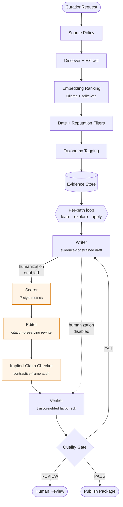

# Content Curation Engine - CCE

An evidence-first content curation engine with enforced citations. Scaling content production without scaling misinformation.

The engine discovers sources, extracts verbatim evidence with provenance, synthesizes citation-backed drafts, and verifies every claim before publishing. If a claim can't be traced to stored evidence, it doesn't ship.

## Architecture



**Core invariant:** the writer produces drafts _only_ from stored evidence objects. The verifier is a separate role that checks every claim. The quality gate enforces "no citation, no ship." Humanization stages (highlighted) are opt-in via `EngineConfig.humanization.enabled` and never extend the writer-iteration budget.

## Package Structure

```
src/cce/
  config/           # Engine configuration (env vars, YAML -> typed objects)
  models/           # Pydantic data contracts (shared across all modules)
  policy/           # Source policy (domain rules, reputation, recency)
  discovery/        # Source discovery + extraction + crawl adapters + embeddings
  evidence/         # Evidence store (SQLite + sqlite-vec, dedup, retrieval)
  tagging/          # Taxonomy plugin protocol + YAML loaders
  synthesis/        # Writer, Editor (humanization), Scorer, ImpliedClaimChecker
  verification/     # Verifier agent (trust-weighted) + quality gate
  orchestrator/     # Pipeline execution, per-path write-verify loop
  llm/              # LLM provider adapters (Anthropic)
  jobs/             # Job store (lifecycle state, stage records)
  output/           # Publish-package writer + MDX emitter
  api/              # REST API via FastAPI
  engine.py         # CurationEngine facade (embedded/remote mode dispatch)
  cli.py            # `cce` CLI (run, batch, emit-mdx, api key generate)
  logging_config.py # JSON/plain log formatter + request-id contextvar
  parsing.py        # Shared JSON extraction helpers for LLM responses
```

## Key Design Points

- **Evidence-first** -- everything is an evidence object before it becomes content
- **Policy-driven intake** -- quality is enforced at discovery, not patched after
- **Writer/critic separation** -- synthesis and verification are distinct roles
- **No citation, no ship** -- the quality gate that prevents misinformation at scale
- **Plugin boundaries** -- taxonomy, output paths, and platform integration are extension points
- **Adapters, not abstractions** -- external deps (crawlers, LLMs, embeddings) are behind Protocol interfaces next to their consumers
- **Config-driven** -- policies, taxonomies, and path configs are YAML; no hardcoded domain logic

## Implementation Status

| Phase | Focus | Status |
|-------|-------|--------|
| 1 | Core loop -- discover, extract, store, write, verify, gate | Complete |
| 2 | Embedding ranking, taxonomy tagging, path-aware writer, policy enforcement | Complete |
| 3 | API layer -- REST endpoints, job orchestration, CLI, MDX emit | Complete |
| 4 | Platform integration -- storage adapter, feedback loop, rendering | Not started |

**Phase 1** delivered the full pipeline loop across 8 live runs. **Phase 2** added semantic evidence ranking (Ollama + sqlite-vec), rules-based taxonomy classification, per-path writer modulation, verifier trust weighting, jurisdiction pass-through, and domain policy templates. **Phase 3** shipped the FastAPI REST layer, `CurationEngine` embedded/remote dispatch, the `cce` CLI, and post-hoc MDX export.

**Humanization stack** (opt-in via `EngineConfig.humanization.enabled`): programmatic style scorer, LLM editor with citation-preservation checks, and an implied-claim checker that catches unfair contrastive framing. See `docs/decompose/humanization/` (internal -- not in public clones) for full design.

## Tech Stack

- **Python >= 3.11** -- managed with uv, linted with ruff, built with hatchling
- **Pydantic v2** -- frozen data contracts and configuration
- **SQLite + sqlite-vec** -- evidence store with vector search
- **Ollama** -- local embedding generation (nomic-embed-text-v2-moe)
- **Anthropic Claude** -- LLM provider for writer and verifier
- **Firecrawl** -- crawl adapter for source discovery
- **pytest** -- async test suite (~700 tests, 90% coverage floor)

## Quick Start

```bash
# Install dependencies
uv sync --all-extras

# Set up environment
cp .env.example .env  # add ANTHROPIC_API_KEY and FIRECRAWL_API_KEY

# Run a batch of topics through the pipeline
uv run cce batch --topics-file policies/examples/topics-batch.yaml --policy-id peer-reviewed

# Or run the REST API server
uv run cce api key generate   # writes a bearer key to ~/.cce/api-key (mode 0600)
uv run cce api start

# Export completed jobs as MDX
uv run cce emit-mdx --all --target <content-dir>

# Run tests
uv run pytest

# Lint
uv run ruff check src/
```

The `scripts/` directory contains older runners and research artifacts -- see `scripts/README.md`. The CLI above is the supported front door.

### Embeddings (optional but on by default)

Semantic evidence ranking expects a local [Ollama](https://ollama.com) server. Install Ollama, run `ollama serve`, and pull the expected model: `ollama pull nomic-embed-text-v2-moe` (served at `http://localhost:11434`). To run without it, set `CCE_EMBEDDING_ENABLED=false` in `.env` -- discovery falls back to keyword ranking.

## Configuration

Precedence: environment variables > optional YAML config file > built-in defaults. See [docs/configuration.md](docs/configuration.md) for the full guide -- every environment variable, the YAML directories, and the Ollama setup in long form.

- **Policies:** `policies/` -- YAML source policies (domain rules, reputation, recency). See `docs/internal/policy-authoring.md` (internal -- not in public clones).
- **Taxonomies:** `taxonomies/` -- YAML taxonomy definitions for evidence classification.
- **Path configs:** `path_configs/` -- YAML output path definitions (tone, structure, depth per path).
- **Engine config:** Environment variables or a YAML config file passed via `--config`. See `docs/configuration.md` and `.env.example`.
