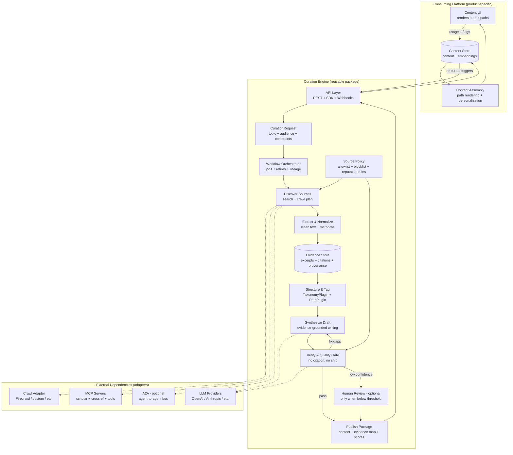
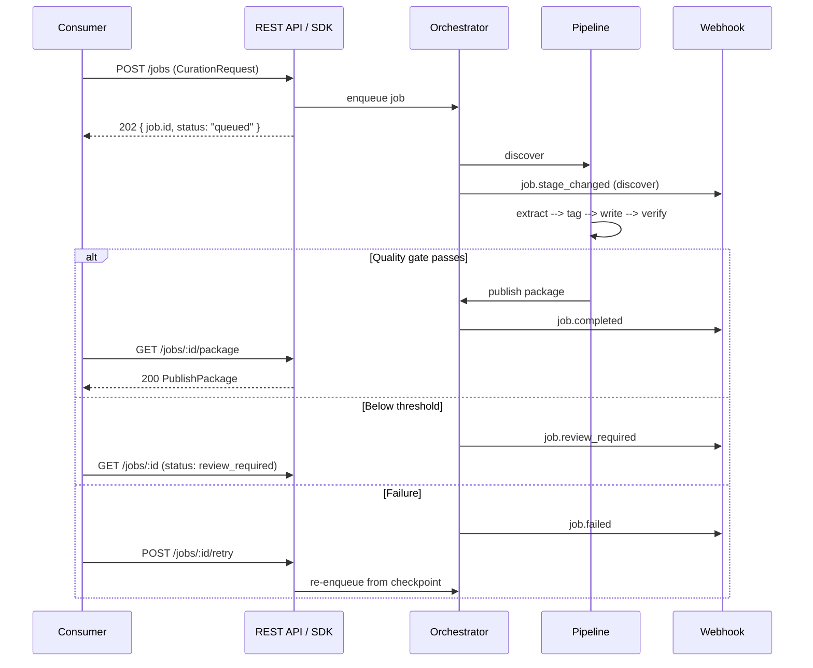

# Content Curation Engine (Reusable Framework)

A product-agnostic architecture for evidence-first content curation with enforced citations. The core idea: scaling content production should not mean scaling misinformation.

This engine is designed to be embedded in any product that needs curated, citation-backed content. Product-specific concerns (taxonomies, output paths, UI integration) are isolated behind configuration and plugin interfaces so the pipeline itself never needs to be forked.

---

## Core Principles

1. **Evidence-first** -- every piece of content traces back to stored, verbatim source excerpts.
2. **Policy-driven intake** -- quality is enforced at discovery time, not patched after the fact.
3. **Separation of writer and critic** -- synthesis and verification are distinct roles to reduce self-reinforcing hallucination.
4. **No citation, no ship** -- the quality gate that prevents misinformation at scale.
5. **Plugin boundaries** -- taxonomy, output paths, and platform integration are extension points, not hardcoded assumptions.

---

## Architecture Blocks

### 1. CurationRequest (input contract)

The only required input to run the engine.

- **Topic** (and optionally subtopics)
- **Output paths** -- which output path(s) to generate, drawn from the configured `PathRegistry` (see "Configuring Output Paths" below)
- **Target audience / reading level**
- **Constraints** -- jurisdiction, date range, domain allow/deny lists, exclusions
- **Risk profile** -- how strict verification should be (drives threshold selection in the quality gate)

### 2. Source Policy (scalability lever)

This is how you prevent exponential human workload as content grows.

- Domain allow/deny lists
- Reputation rules (peer-reviewed, primary sources, known institutions, etc.)
- Recency rules (when recency matters, when it doesn't)
- Conflict-of-interest rules (marketing pages vs. primary research)
- Per-topic overrides (some topics need stricter rules)

The policy feeds both **Discovery** and **Verification**, so the system rejects bad inputs early rather than trying to fix quality downstream.

### 3. Discover --> Extract --> Evidence Store (evidence-first pipeline)

The engine treats everything as **evidence objects** first, not "content."

- **Discover Sources** -- search + crawl plan (seed queries, domains, time bounds), executed through adapter interfaces so the underlying provider (Firecrawl, custom crawler, MCP tool, etc.) is swappable.
- **Extract & Normalize** -- clean text, structured metadata, canonical URLs, authors, dates.
- **Evidence Store** -- persist *verbatim excerpts* + provenance (where it came from, when it was retrieved, how it was accessed).

When this is done correctly, writing becomes a downstream formatting step instead of a hallucination risk.

### 4. Structure & Tag (plugin interface)

This is where raw evidence is mapped into the consuming product's domain model. Because every product has a different ontology, this block is a **plugin interface** with two extension points:

- **TaxonomyPlugin** -- defines the set of tags/dimensions/categories that evidence and content are classified into. A well-being app might use 8 wellness dimensions; a legal research tool might use practice areas and jurisdictions; a developer education platform might use technology domains.
- **PathPlugin** -- defines the output paths that content can be generated along. One product might use "Learn / Explore / Apply"; another might use "Summary / Deep-Dive / Reference."

The engine ships with no built-in taxonomy or path set. Implementers register their own via configuration (see "Implementer Configuration" below).

### 5. Synthesize Draft (writer) + Verify (critic)

Two separate roles, never collapsed into one.

- **Writer** -- produces a draft **only from evidence objects**, with inline citations. It receives the tagged evidence graph and the target output path as inputs.
- **Verifier** -- checks every claim against the evidence store, catches contradictions, and assigns a confidence score. It also checks that taxonomy tags are applied correctly.

This separation is one of the simplest ways to reduce the problem of a model talking itself into believing itself.

### 6. Quality Gate ("no citation, no ship")

The rule that prevents scaling misinformation. Typical gates:

- Every paragraph (or every atomic claim) has at least one citation.
- Citations resolve to stored evidence excerpts (not just raw URLs).
- Conflicts are either resolved or explicitly labeled ("evidence is mixed").
- Confidence score is above the configured autopublish threshold.
- Anything below threshold routes to **Human Review** (optional).

Thresholds and gate rules are part of the engine's runtime configuration, not hardcoded.

### 7. Publish Package (output contract)

The engine emits a structured package that the consuming platform can safely display and index:

- Rendered content (Markdown / MDX / HTML, configurable)
- Structured outline (modules, sections, path-specific steps)
- Citations + bibliography
- **Evidence map** (claim --> evidence excerpt(s))
- Scores: confidence, coverage, recency, source diversity
- Lineage: engine version, policy version, run ID, timestamps

The evidence map is what makes the system auditable at scale.

---

## How This Avoids Exponential Curation Workload

The design scales because the hard parts are systematized:

- **Policy-driven discovery** limits low-quality intake automatically.
- **Evidence store + dedup** prevents re-curating the same sources repeatedly.
- **Quality gates** decide whether content can autopublish, needs revision, or needs human review.
- **Re-curate triggers** (usage flags, source updates, new research) drive targeted reprocessing instead of manual "content audits."

---

## Architecture Diagram



---

## Implementer Configuration

These are the decisions each product team makes when embedding the engine. None of them require modifying engine internals.

### Taxonomy Registration

Define the set of tags that evidence and content are classified into. The engine expects an implementation of `TaxonomyPlugin` that provides:

- A list of valid tag identifiers and display names
- A classifier function (or prompt template) that maps an evidence object to one or more tags
- Optional: hierarchical relationships between tags (parent/child)

**Example configurations:**

| Product | Taxonomy |
|---|---|
| Well-being platform | 8 wellness dimensions (physical, emotional, social, ...) |
| Legal research tool | Practice areas + jurisdictions |
| Developer education | Technology domains + skill levels |
| Financial advisory | Asset classes + risk categories |

### Output Path Registration

Define the output paths that content can be generated along. The engine expects an implementation of `PathPlugin` that provides:

- A list of valid path identifiers and display names
- A rendering strategy per path (what structure the output should take)
- Optional: path-specific prompt templates for the writer

**Example configurations:**

| Product | Paths |
|---|---|
| Well-being platform | Learn, Explore, Apply |
| Legal research tool | Summary, Full Analysis, Client Memo |
| Developer education | Concept, Tutorial, Reference |
| Financial advisory | Overview, Risk Analysis, Action Items |

An important simplification: treat your output paths as **different renderers over the same evidence graph**, not separate research pipelines. This keeps cost and complexity down while maintaining consistency across paths.

### Platform Integration

The engine's Publish Package is a neutral data structure. The consuming platform is responsible for:

- **Storage** -- where to persist the package (database, CMS, object store, etc.)
- **Rendering** -- how to display content and citations in the product's UI
- **Feedback loop** -- how to send usage signals (flags, views, ratings) back to the engine to trigger re-curation
- **Access control** -- who can see what content (the engine itself is access-unaware)

### Quality Gate Configuration

Configure thresholds per risk profile:

| Risk Profile | Autopublish Threshold | Min Citations/Paragraph | Conflict Handling |
|---|---|---|---|
| Low (informational) | 0.7 | 1 | Label as mixed |
| Medium (advisory) | 0.85 | 2 | Require resolution or human review |
| High (regulated) | 0.95 | 2 | Mandatory human review for any conflict |

---

## Data Contracts

Kept minimal and enforceable. Generic types replace any product-specific assumptions.

```ts
// --- Configuration types (provided by implementer) ---

type TaxonomyConfig = {
  id: string
  tags: Array<{ id: string; label: string; parentId?: string }>
  classifierPrompt?: string  // prompt template for auto-tagging
}

type PathConfig = {
  id: string
  paths: Array<{ id: string; label: string; renderStrategy: string }>
  writerPrompts?: Record<string, string>  // path-specific prompt overrides
}

// --- Engine types ---

type CurationRequest = {
  topic: string
  paths: string[]             // drawn from the registered PathConfig
  audience?: string           // free-form or enum per product
  constraints?: {
    dateRange?: { from: string; to: string }
    domainsAllow?: string[]
    domainsDeny?: string[]
    jurisdiction?: string
  }
  policyId: string
  taxonomyId: string          // which TaxonomyConfig to use
  pathConfigId: string        // which PathConfig to use
  riskProfile?: string        // maps to quality gate thresholds
}

type Evidence = {
  id: string
  url: string
  title?: string
  author?: string
  publishedAt?: string
  retrievedAt: string
  excerpt: string             // verbatim snippet stored for auditing
  locator?: string            // section/heading/paragraph index if available
}

type ContentUnit = {
  id: string
  path: string                // matches a registered path id
  tags: string[]              // matches registered taxonomy tag ids
  content: string             // markdown / mdx / html
  citations: Array<{ evidenceId: string; url: string }>
  evidenceMap: Array<{ claim: string; evidenceIds: string[] }>
  scores: {
    confidence: number
    coverage: number
    sourceDiversity: number
  }
  lineage: {
    policyId: string
    taxonomyId: string
    pathConfigId: string
    runId: string
    engineVersion: string
  }
}
```

---

## Where MCP / A2A Fits Without Complicating the Core

Keep the core engine small and deterministic; put interoperability in adapters.

- **MCP servers** -- scholarly search, DOI metadata, citation formatting, additional validators. Each is registered as an adapter behind a common tool interface.
- **A2A (optional)** -- distribute specialized agents (e.g., a domain-specific reviewer agent, a compliance checker agent) behind the same adapter interface.

The orchestrator should not care whether a capability is local code, an MCP tool, or an A2A peer. It only cares that the capability returns typed results conforming to the engine's contracts.

---

## API

The engine is exposed through two layers: a REST API for service-based deployments, and a TypeScript SDK that wraps it for embedded use. Consumers pick whichever fits their architecture -- or use both (e.g., SDK in the same monorepo, REST for a separate team's integration).

### Request Lifecycle



### REST API

All endpoints are prefixed with `/v1/curate`. Responses follow a consistent envelope: `{ data, error, meta }`.

#### Curation Workflow

```
POST   /v1/curate/jobs
```
Submit a new curation request. Accepts a `CurationRequest` body. Returns a `Job` with status `queued`.

```
GET    /v1/curate/jobs/:jobId
```
Poll job status. Returns the current `Job` object including `status`, `progress` (stage the pipeline is in), and any intermediate diagnostics.

```
GET    /v1/curate/jobs/:jobId/package
```
Retrieve the Publish Package once the job reaches `completed`. Returns the full `PublishPackage` (content units, evidence map, scores, lineage). Returns `404` if the job is still running or `410` if the package has been purged.

```
GET    /v1/curate/jobs/:jobId/evidence
```
Retrieve the raw evidence graph for a job -- useful for debugging or building custom renderers on top of the evidence without using the engine's writer.

```
POST   /v1/curate/jobs/:jobId/retry
```
Re-run a failed or partially completed job from the last successful stage. The engine stores stage checkpoints, so this does not restart discovery if extraction already completed.

```
DELETE /v1/curate/jobs/:jobId
```
Cancel a running job or delete a completed job's artifacts.

```
GET    /v1/curate/jobs
```
List jobs with filtering by status, topic, date range, and policy. Paginated.

#### Webhooks

```
POST   /v1/curate/webhooks
GET    /v1/curate/webhooks
DELETE /v1/curate/webhooks/:webhookId
```
Register a callback URL to receive events instead of polling. Supported events: `job.stage_changed`, `job.completed`, `job.failed`, `job.review_required`.

Webhook payloads include the `jobId`, event type, and a summary (not the full package) to keep payloads small. The consumer fetches the full package via `GET /jobs/:jobId/package` when ready.

#### Evidence Store (read-only)

```
GET    /v1/curate/evidence/:evidenceId
```
Retrieve a single evidence object by ID.

```
GET    /v1/curate/evidence?url=...&topic=...
```
Search the evidence store. Useful for checking whether the engine already has evidence for a topic before submitting a new job.

#### Health & Metadata

```
GET    /v1/curate/health
GET    /v1/curate/meta
```
Health check and engine metadata (version, loaded policies, registered taxonomies/paths, adapter status).

### SDK

The SDK is a typed TypeScript package that can be used in two modes:

**Remote mode** -- thin client that calls the REST API under the hood. Useful when the engine runs as a separate service.

**Embedded mode** -- runs the pipeline in-process. Useful for monorepo setups, local development, or single-tenant deployments where a separate service is overhead.

The interface is the same in both modes. The consumer picks a mode at initialization.

```ts
import { CurationEngine } from "@your-org/curation-engine"

// Remote mode -- talks to a deployed instance
const engine = CurationEngine.remote({
  baseUrl: "https://curate.internal.example.com",
  apiKey: process.env.CURATION_API_KEY,
})

// Embedded mode -- runs the pipeline locally
const engine = CurationEngine.embedded({
  evidenceStore: myDatabaseAdapter,
  llmProvider: myLlmAdapter,
  crawlAdapter: myFirecrawlAdapter,
})
```

#### Core Methods

```ts
// Submit a curation request. Returns a Job handle.
const job = await engine.curate({
  topic: "cognitive behavioral therapy for insomnia",
  paths: ["summary", "deep-dive"],
  audience: "clinician",
  policyId: "peer-reviewed-only",
  taxonomyId: "health-conditions",
  pathConfigId: "clinical-content",
  riskProfile: "high",
})

// Poll status (remote mode) or await completion (embedded mode)
const status = await job.status()
// { status: "running", stage: "verify", progress: { completed: 4, total: 5 } }

// Stream stage transitions as they happen
for await (const event of job.events()) {
  console.log(event.stage, event.status)
}

// Retrieve the publish package
const pkg = await job.package()
// pkg.units     -- ContentUnit[]
// pkg.evidence  -- Evidence[]
// pkg.scores    -- aggregate scores
// pkg.lineage   -- full run metadata

// Retry from last checkpoint
await job.retry()

// Cancel
await job.cancel()
```

#### Evidence Store Access

```ts
// Check if evidence already exists for a topic
const existing = await engine.evidence.search({ topic: "CBT insomnia", limit: 10 })

// Get a single evidence object
const ev = await engine.evidence.get("ev_abc123")
```

### Data Contracts (API additions)

These types extend the data contracts defined earlier.

```ts
type JobStatus = "queued" | "running" | "completed" | "failed" | "cancelled" | "review_required"

type JobStage = "discover" | "extract" | "tag" | "write" | "verify" | "publish"

type Job = {
  id: string
  request: CurationRequest
  status: JobStatus
  stage?: JobStage
  progress?: { completed: number; total: number }
  createdAt: string
  updatedAt: string
  completedAt?: string
  error?: { code: string; message: string; stage: JobStage }
}

type PublishPackage = {
  jobId: string
  units: ContentUnit[]
  evidence: Evidence[]
  scores: {
    confidence: number
    coverage: number
    sourceDiversity: number
    recency: number
  }
  lineage: {
    policyId: string
    taxonomyId: string
    pathConfigId: string
    runId: string
    engineVersion: string
    stages: Array<{ stage: JobStage; startedAt: string; completedAt: string }>
  }
}

type WebhookEvent = {
  id: string
  type: "job.stage_changed" | "job.completed" | "job.failed" | "job.review_required"
  jobId: string
  timestamp: string
  data: {
    stage?: JobStage
    status: JobStatus
    summary?: string
  }
}
```

### Authentication & Rate Limiting

The API uses bearer tokens for authentication. The engine itself is auth-agnostic -- it delegates to whatever auth middleware the deployment provides. The SDK accepts an `apiKey` or a custom `authProvider` function for more complex setups (e.g., OAuth, service-to-service tokens).

Rate limiting is recommended at the gateway level rather than inside the engine. Curation jobs are inherently expensive (LLM calls, crawling), so the practical constraint is usually cost, not throughput. The `/meta` endpoint exposes current queue depth to help consumers make backpressure decisions.

---

## Extending the Engine

When you need to add a new capability, the decision tree is:

1. **New taxonomy or output paths?** -- Register a new `TaxonomyConfig` or `PathConfig`. No engine changes.
2. **New source type?** -- Write a new discovery adapter. Implement the adapter interface, register it with the orchestrator.
3. **New verification rule?** -- Add a gate rule to the quality gate configuration. If it requires custom logic, implement a verifier plugin.
4. **New external tool?** -- Wrap it as an MCP server or adapter. Register it with the orchestrator.
5. **New output format?** -- Add a renderer in the consuming platform's content assembly layer. The Publish Package stays the same.

In all cases, the core pipeline (Discover --> Extract --> Store --> Tag --> Write --> Verify --> Publish) remains unchanged.
