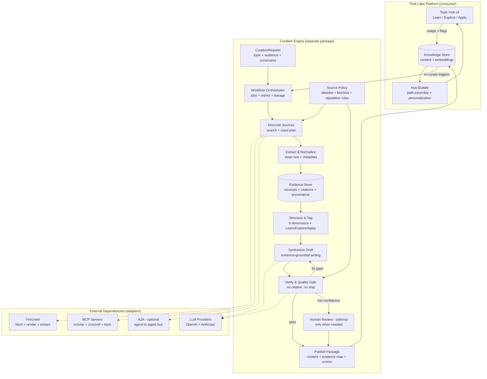

# Content Curation Engine

Use this architecture as a baseline. It’s built around a single principle: **evidence-first curation with enforced citations**, so scaling doesn’t mean scaling misinformation. Lighten the work load on us that way we do not have to write all the content ourselves.

## What each block is responsible for

### 1) CurationRequest (input contract)

This is the only required input to run the engine.

* Topic (and optionally subtopics)
* Target audience/reading level
* Output type (Learn / Explore / Apply, or all three)
* Constraints (jurisdiction, dates, exclusions, required domains, etc.)
* Risk profile (how strict verification should be)

### 2) Source Policy (scalability lever)

This is how you prevent exponential human workload as content grows:

* Domain allow/deny lists
* Reputation rules (peer-reviewed, primary sources, known institutions, etc.)
* Recency rules (when recency matters, when it doesn’t)
* Conflict-of-interest rules (marketing pages vs primary research)
* Per-topic overrides (some topics need stricter rules)

This policy feeds **Discovery** and **Verification**, so the system doesn’t “fix quality later.” It avoids bad inputs early.

### 3) Discover → Extract → Evidence Store (evidence-first)

The engine should treat everything as evidence objects first, not “content.”

* **Discover Sources**: search + crawl plan (seed queries, domains, time bounds)
* **Extract & Normalize**: clean text, structured metadata, canonical URLs, authors, dates
* **Evidence Store**: persist *verbatim excerpts* + provenance (where it came from)

If you do this right, writing becomes a *downstream formatting step* instead of a hallucination risk.

### 4) Structure & Tag (Thnk Labs-specific plug-in, but engine-generic)

This is where you map raw evidence into:

* the **8 well-being dimensions**
* the **Learn / Explore / Apply** paths

In the engine, make this a plugin interface so other products can swap taxonomies without rewriting the pipeline.

### 5) Synthesize Draft (writer) + Verify (critic) as separate roles

Don’t have one model do everything.

* **Writer**: produces a draft **only from evidence objects** (with citations)
* **Verifier**: checks every claim has evidence, catches contradictions, and assigns confidence

This separation is one of the easiest ways to reduce “model talks itself into believing itself.”

### 6) Quality Gate: “no citation, no ship”

This is the rule that keeps you from scaling misinformation.
Typical gates:

* Every paragraph (or every atomic claim) has at least one citation
* Citations resolve to stored evidence excerpts (not just raw URLs)
* Conflicts are either resolved or explicitly labeled (“evidence is mixed”)
* Confidence score above threshold for autopublish
* Anything below threshold routes to Human Review (optional)

### 7) Publish Package (output contract)

The engine should emit a package that the platform can safely display and index:

* Rendered content (Markdown/MDX/HTML)
* Structured outline (modules, sections, “Apply” steps)
* Citations + bibliography
* **Evidence map** (claim → evidence excerpt(s))
* Scores: confidence, coverage, recency, source diversity
* Lineage: engine version, policy version, run ID, timestamps

That “evidence map” is what makes your system auditable at scale.

## How this avoids exponential curation workload

This design scales because the “hard parts” are **systematized**:

* **Policy-driven discovery** limits low-quality intake automatically.
* **Evidence store + dedup** prevents re-curating the same sources repeatedly.
* **Quality gates** decide whether content can autopublish, needs revision, or needs human review.
* **Re-curate triggers** (usage flags, source updates, new research) drive *targeted* reprocessing instead of manual “content audits.”



---

## Minimal data contracts (keep them boring and enforceable)

You can keep it as small as this:

```ts
type CurationRequest = {
  topic: string
  paths: Array<"learn" | "explore" | "apply">
  audience?: "general" | "intermediate" | "expert"
  constraints?: {
    dateRange?: { from: string; to: string }
    domainsAllow?: string[]
    domainsDeny?: string[]
    jurisdiction?: string
  }
  policyId: string
}

type Evidence = {
  id: string
  url: string
  title?: string
  author?: string
  publishedAt?: string
  retrievedAt: string
  excerpt: string          // verbatim snippet stored for auditing
  locator?: string         // section/heading/paragraph index if available
}

type ContentUnit = {
  id: string
  path: "learn" | "explore" | "apply"
  dimensions: string[]     // your 8-dimension tags
  content: string          // markdown/mdx/html
  citations: Array<{ evidenceId: string; url: string }>
  evidenceMap: Array<{ claim: string; evidenceIds: string[] }>
  scores: { confidence: number; coverage: number; sourceDiversity: number }
  lineage: { policyId: string; runId: string; engineVersion: string }
}
```

## Where MCP / A2A fits without complicating the core

Keep the core engine small and deterministic; put interoperability in adapters:

* MCP servers: scholarly search, DOI metadata, citation formatting, additional validators
* A2A (optional): distribute specialized agents (e.g., “anxiety reviewer agent”, “finance reviewer agent”) behind the same `ToolGateway` interface

The orchestrator shouldn’t care whether a capability is local code, an MCP tool, or an A2A peer—only that it returns typed results.

---

If you want one extra simplification that usually helps: treat **Learn / Explore / Apply** as *three output renderers* over the **same evidence graph**, not three separate research pipelines. That keeps cost and complexity down while keeping consistency across paths.
